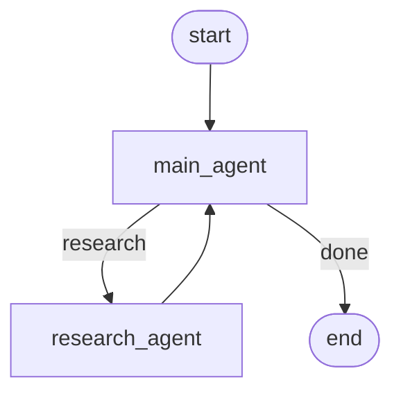

# Dossier

A research agent that plans its own web research, files every fact as a sourced record, and answers
follow-ups from that record.

LangGraph · Django · React · OpenAI `gpt-5.6-luna` · Tavily · MCP

## Setup

```bash
python -m venv venv && source venv/bin/activate    # Windows: venv\Scripts\activate
pip install -r requirements.txt
cp .env.example .env                               # set OPENAI_API_KEY and TAVILY_API_KEY
```

Run each of these in its own terminal. Start the MCP server first:

```bash
python backend/mcp_server.py                          # MCP on :8001
python backend/manage.py runserver 8000 --noreload    # API on :8000
cd frontend && npm install && npm run dev             # UI on :5173
```

## Graph



- **main_agent** has four tools: `check_memory`, `retrieve`, `research`, `answer`. It answers from
  the case file, or sends a research plan to the Research Agent.
- **research_agent** has four tools: `web_search`, `fetch_page`, `write_findings`, `report`. The
  two web tools are calls to the MCP server.
- Each research pass returns to `main_agent`, which decides again. The loop runs until the agent
  decides it can answer, with a safety cap of 5 passes.

## MCP

`http://127.0.0.1:8001/mcp` (streamable HTTP) exposes `web_search`, `web_fetch`, `get_info`,
`retrieve`, `write` and `ask`.

## Tokens

Measured on a case file of 89 findings (11,648 tokens).

| Question | Whole dossier | Retrieved | Saved |
|---|---|---|---|
| how does jev work? | 11,648 | 1,214 | 89.6% |
| limitations of hybrid search? | 11,648 | 826 | 92.9% |
| how are pmsm motors controlled? | 11,648 | 994 | 91.5% |

- Before retrieval was tightened, "how does jev work?" retrieved 3,281 tokens (51.9% saved).
- A turn answered from memory costs about 8k model tokens. A research turn cost 267k.
- Every turn is logged to `backend/data/token_log.jsonl` and served at `GET /api/tokens/`.
